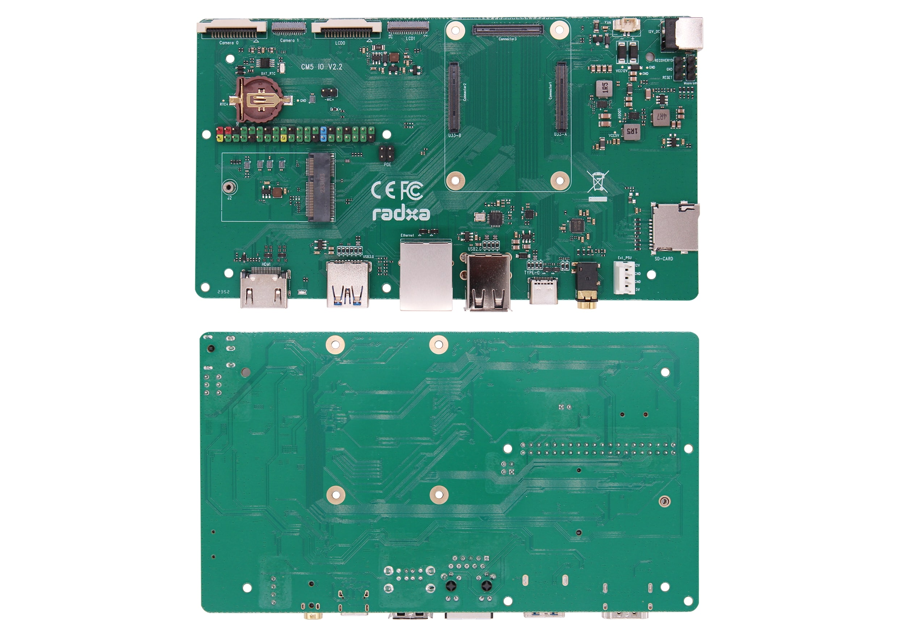

# Radxa CM5 IO ASCII
[The files](https://github.com/radxa/radxa-cm-projects/tree/main/cm5/radxa-cm5-io-board) from the [original repository](https://github.com/radxa/radxa-cm-projects) are in binary format, which cannot be imported into EasyEDA. I used Altium Designer to convert the files to ASCII format. The files in this repository are the results. I have not modified the files in any way. The files are provided as is. If you find any errors, please open an issue. If I see that it's a problem with the conversion, I will try to fix it. If it's a problem with the original files, I will let you know, and you can open an issue in the original repository.

You can import the files into EasyEDA by following the instructions in the [EasyEDA documentation](https://prodocs.easyeda.com/en/import-export/import-altium-designer/).

The original repository does not specify a license. I am assuming that it is licensed under the [GPL-3.0](https://www.gnu.org/licenses/gpl-3.0.en.html) license, as the [Radxa CM5 IO Board Repository](https://github.com/radxa-build/radxa-cm5-io) by [Radxa Build](https://github.com/radxa-build) uses it. If you are the owner and want me to remove them, please open an issue, and I will remove them.

These are v2200. If new versions are released and you would like me to convert them, please open an issue, and I will try to find the time to convert them.

In case of the original links not working, here are some Wayback Machine links:
- [EasyEDA Documentation for Importing Altium Designer Files](https://web.archive.org/web/20250307052202/https://prodocs.easyeda.com/en/import-export/import-altium-designer/)
- [GPL-3.0 License](https://web.archive.org/web/20250305235411/https://www.gnu.org/licenses/gpl-3.0.en.html)

## Other stuff
I'm working on a laptop based on the CM5 and CM5 IO Board. I'd appreciate it if you could check out [my blog](https://marvil.co/blog/) and [subscribe my channel](https://www.youtube.com/@marvil-dot-co) on YouTube!